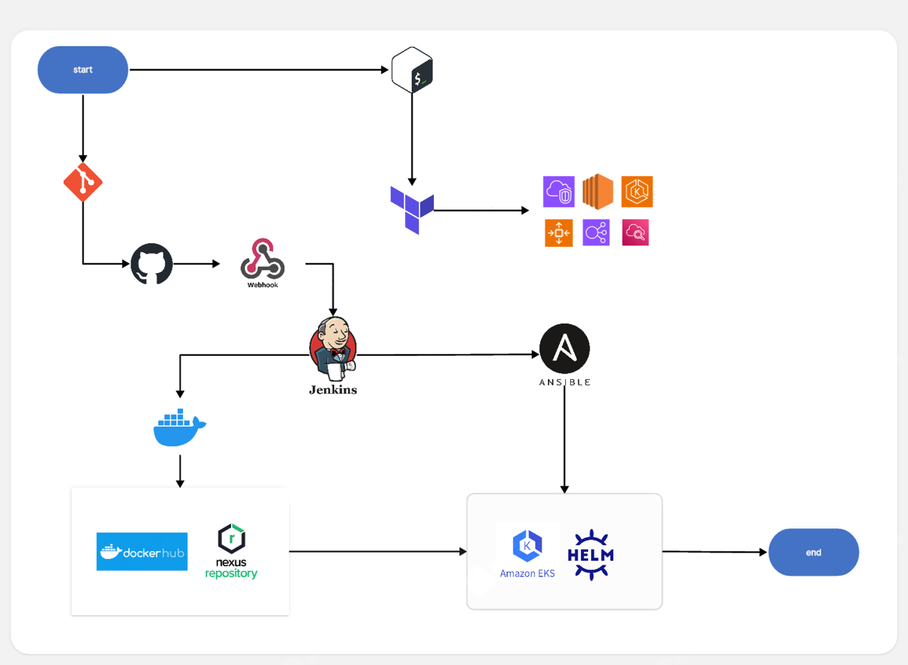
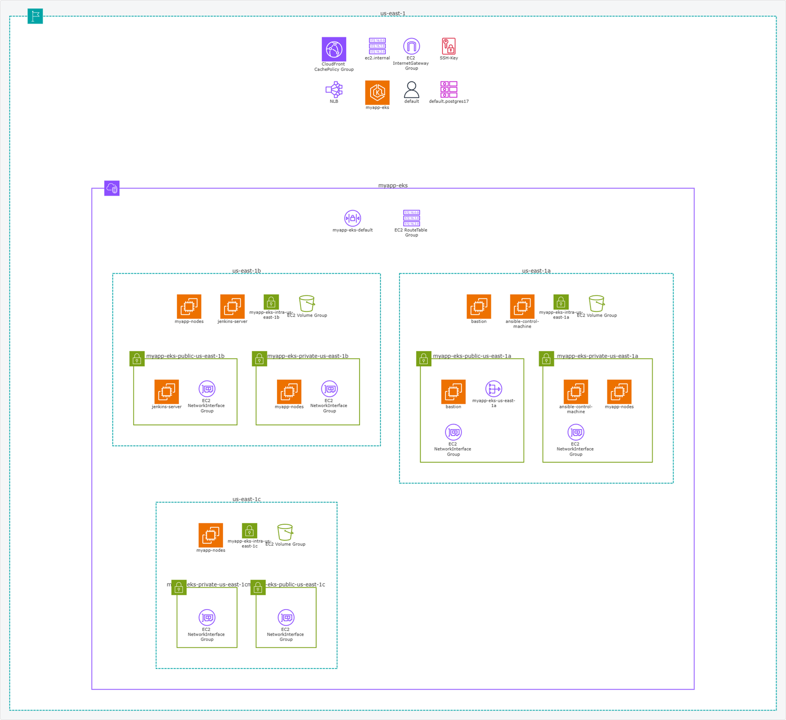

# AWS EKS DevOps Project

End-to-end DevOps project on AWS using Terraform, Jenkins CI/CD, Docker, Kubernetes (EKS), Helm, Nexus, and CloudWatch. Implements infrastructure automation, container orchestration, and multi-environment deployment with monitoring.

## 📋 Project Overview

This project implements a robust DevOps pipeline that:

- Provisions AWS infrastructure using Terraform (EKS cluster, EC2 instances, networking)
- Automates configuration with Ansible (Jenkins, EKS access, Helm deployments)
- Builds and containerizes a custom Spring Boot application with React frontend
- Orchestrates deployments on Kubernetes with Helm charts
- Manages Docker artifacts with Nexus Repository
- Automates CI/CD with Jenkins pipelines triggered by GitHub webhooks
- Supports multiple environments (dev, test, prod) with environment-specific configurations

## 🏗️ Architecture




### Infrastructure Stack

- **Cloud Provider**: AWS
- **Container Orchestration**: Elastic Kubernetes Service (EKS)
- **CI/CD Server**: Jenkins on EC2
- **Configuration Server**: Ansible Control Machine on EC2
- **Artifact Management**: Nexus Repository on EKS
- **Database**: PostgreSQL StatefulSet on Kubernetes
- **Ingress Controller**: NGINX Ingress Controller

### Tooling Stack

- **Infrastructure as Code**: Terraform
- **Configuration Management**: Ansible
- **Containerization**: Docker
- **Orchestration**: Kubernetes (EKS)
- **Package Management**: Helm 3
- **Monitoring**: AWS CloudWatch
- **Version Control**: GitHub with Webhooks

## 🎯 Application Overview

### DevOps Deployment Dashboard

A full-stack Spring Boot + React application that provides real-time visibility into deployment operations.

**Features**:
- Real-time deployment tracking
- Environment-specific deployment management
- RESTful API for deployment operations
- React-based frontend with modern UI
- PostgreSQL persistence for deployment history
- Docker containerization for both backend and frontend

**Tech Stack**:
- Backend: Spring Boot 3.x, Java 17, PostgreSQL
- Frontend: React, Node.js, Nginx
- Build: Maven (backend), npm (frontend)

## 📁 Repository Structure

```
aws-eks-devops-project/
│
├── ansible/                          # Configuration management
│   ├── ansible.cfg                   # Ansible configuration
│   ├── inventory                     # Dynamic inventory file
│   ├── site.yml                      # Main playbook orchestrator
│   ├── playbooks/                    # Individual playbooks
│   │   ├── deploy-helm.yml          # Helm chart deployments
│   │   ├── eks-access.yml           # EKS cluster access setup
│   │   ├── install-controller.yml   # Ingress controller installation
│   │   ├── install-jenkins-plugins.yml  # Jenkins plugins automation
│   │   └── install-jenkins.yml      # Jenkins installation
│   ├── roles/                        # Ansible roles
│   │   ├── common/                  # Common tasks
│   │   ├── eks-access/              # EKS authentication
│   │   ├── helm/                    # Helm operations
│   │   └── jenkins/                 # Jenkins configuration
│   └── vars/                         # Variables and secrets
│       ├── main.yml
│       └── secrets.yml              # Encrypted sensitive data
│
├── application/                      # Spring Boot + React application
│   ├── src/main/java/               # Spring Boot backend
│   ├── frontend/                     # React frontend
│   │   ├── src/
│   │   ├── public/
│   │   └── package.json
│   ├── Dockerfile                    # Backend container
│   ├── docker-compose.yaml          # Local development setup
│   ├── pom.xml                      # Maven configuration
│   └── tests/                       # API tests
│       └── test_api_dashboard.py
│
├── EKS/terraform/                    # EKS infrastructure
│   ├── main.tf                      # Main Terraform configuration
│   ├── eks.tf                       # EKS cluster definition
│   ├── kubernetes.tf                # Kubernetes provider setup
│   ├── nexus.tf                     # Nexus deployment
│   ├── nginx-ingress.tf             # Ingress controller
│   ├── security_groups.tf           # Network security
│   ├── roles.tf                     # IAM roles and policies
│   ├── kubeconfig.tf                # Kubeconfig generation
│   ├── ansible-vars.tf              # Ansible variable generation
│   ├── variables.tf                 # Input variables
│   ├── outputs.tf                   # Output values
│   └── templates/                   # Template files
│       ├── ansible-vars.yml.tpl
│       └── kubeconfig.yml.j2
│
├── helm/                             # Helm charts
│   ├── app-chart/                   # Application chart
│   │   ├── Chart.yaml
│   │   ├── values.yaml              # Default values
│   │   ├── values-dev.yaml.j2       # Dev environment values
│   │   ├── values-test.yaml.j2      # Test environment values
│   │   ├── values-prod.yaml.j2      # Prod environment values
│   │   └── templates/               # Kubernetes manifests
│   │       ├── backend-deployment.yaml
│   │       ├── backend-service.yaml
│   │       ├── frontend-deployment.yaml
│   │       ├── frontend-service.yaml
│   │       ├── app-configmap.yaml
│   │       ├── app-secrets.yaml
│   │       └── app-ingress.yaml
│   └── postgres-chart/              # PostgreSQL chart
│       ├── Chart.yaml
│       ├── values.yaml
│       ├── values-dev.yaml.j2
│       ├── values-test.yaml.j2
│       ├── values-prod.yaml.j2
│       └── templates/
│           ├── postgres-statefulset.yaml
│           ├── postgres-service.yaml
│           └── postgres-configmap.yaml
│
├── Jenkins/                          # Jenkins configuration
│   ├── Jenkinsfile                  # Pipeline definition
│   └── Dockerfile                   # Custom Jenkins image
│
├── terraform/servers-setup/         # Initial EC2 setup
│   ├── main.tf                      # Jenkins & Ansible servers
│   ├── outputs.tf                   # Server IP outputs
│   └── terraform.tfvars             # Variable values
│
└── scripts/                          # Automation scripts
    ├── manage_infrastructure.sh     # Infrastructure management
    └── cleanup.sh                   # Resource cleanup
```

## 🚀 Complete Setup Guide

### Prerequisites

- **AWS Account** with appropriate permissions
- **AWS CLI** configured with credentials
- **Terraform** v1.5+
- **Ansible** v2.12+
- **Docker** and Docker Compose
- **kubectl** v1.28+
- **Helm** v3.10+
- **Git** with SSH key configured for GitHub

### Step 1: Deploy Initial Infrastructure

Run the infrastructure management script to provision EC2 instances (Jenkins & Ansible servers):

```bash
cd scripts
./manage_infrastructure.sh apply
```

This script:
- Provisions Jenkins and Ansible EC2 instances
- Sets up VPC, subnets, and security groups
- Configures SSH access
- Outputs instance IP addresses

**Note the output IPs** - you'll need them for subsequent steps.

### Step 2: Deploy EKS Cluster and Services

Deploy the EKS cluster along with Nexus and Ingress controller:

```bash
cd EKS/terraform
terraform init
terraform plan
terraform apply -auto-approve
```

This provisions:
- EKS cluster with managed node groups
- Nexus Repository on Kubernetes
- NGINX Ingress Controller with Network Load Balancer
- IAM roles and security groups
- Generates Ansible inventory and variables

### Step 3: Configure Local DNS Resolution

Add the Network Load Balancer address to your local hosts file for accessing services via custom domains.

**Linux/Mac**:
```bash
# Get the NLB DNS name from Terraform output
export NLB_DNS=$(terraform output -raw ingress_nlb_dns)
export NLB_IP=$(dig +short $NLB_DNS | head -n1)

# Add to /etc/hosts
sudo bash -c "cat >> /etc/hosts << EOF
$NLB_IP app-dev.local
$NLB_IP nexus.local
$NLB_IP app-test.local
$NLB_IP app-prod.local
EOF"
```

**Windows**:
```powershell
# Get the NLB IP (use nslookup on the DNS name from Terraform output)
# Edit C:\Windows\System32\drivers\etc\hosts
# Add these lines:
<NLB_IP> app-dev.local
<NLB_IP> nexus.local
<NLB_IP> app-test.local
<NLB_IP> app-prod.local
```

### Step 4: Configure Jenkins via Ansible

SSH into the Ansible control machine and run the playbook to install Jenkins plugins:

```bash
# SSH to Ansible server
ssh -i <your-key>.pem ec2-user@<ansible-server-ip>

# Navigate to ansible directory
cd /path/to/ansible

# Run Jenkins plugins installation playbook
ansible-playbook -i inventory playbooks/install-jenkins-plugins.yml
```

This playbook installs essential Jenkins plugins:
- Git plugin
- Docker Pipeline
- Kubernetes plugin
- Pipeline plugins
- Maven and NodeJS plugins

### Step 5: Configure Jenkins

Access Jenkins via SSH tunnel:

```bash
ssh -L 8080:localhost:8080 -i <your-key>.pem ec2-user@<jenkins-server-ip>
```

Open http://localhost:8080 in your browser.

**Initial Setup**:

1. Get initial admin password:
   ```bash
   ssh -i <your-key>.pem ec2-user@<jenkins-server-ip> "sudo cat /var/lib/jenkins/secrets/initialAdminPassword"
   ```

2. Complete the setup wizard

3. **Configure Global Tools** (Manage Jenkins → Global Tool Configuration):
   - **Maven**: Add Maven installation (name: `Maven`, install automatically)
   - **NodeJS**: Add NodeJS installation (name: `NodeJS`, version: 18.x, install automatically)

4. **Add Credentials** (Manage Jenkins → Credentials → System → Global credentials):
   - **GitHub**: Add SSH private key or Personal Access Token
   - **AWS**: Add AWS credentials (Access Key ID and Secret Access Key)
   - **Docker Registry**: Add Nexus credentials (username/password)
   - **Kubernetes**: kubeconfig file (generated by Terraform in `EKS/terraform/kubeconfig.yaml`)

### Step 6: Configure Nexus Repository

Access Nexus at http://nexus.local

**Initial Setup**:

1. Sign in with default credentials:
   - Username: `admin`
   - Password: Get from pod logs:
     ```bash
     kubectl get pods -n eks-build | grep nexus
     kubectl logs -n eks-build <nexus-pod-name> | grep password
     ```

2. Complete the setup wizard and change the admin password

**Configure Docker Repository**:

1. Navigate to **Server administration and configuration** (gear icon)

2. **Enable Docker Bearer Token Realm**:
   - Go to **Security → Realms**
   - Add "Docker Bearer Token Realm" to Active realms
   - Save

3. **Create Docker Hosted Repository**:
   - Go to **Repository → Repositories → Create repository**
   - Select **docker (hosted)**
   - Configuration:
     - **Name**: `docker-hosted`
     - **HTTP**: Check "Enable" and set port to `8082`
     - **Allow anonymous docker pull**: Check if desired
     - **Deployment policy**: Allow redeploy
   - Click **Create repository**

4. **Verify Connectivity**:
   ```bash
   # From any node with docker
   docker login nexus.local:8082
   # Enter nexus credentials
   ```

### Step 7: Configure GitHub Webhook

1. Go to your GitHub repository settings
2. Navigate to **Settings → Webhooks → Add webhook**
3. Configure:
   - **Payload URL**: `http://<jenkins-public-ip>:8080/github-webhook/`
   - **Content type**: `application/json`
   - **Events**: Select "Just the push event"
   - **Active**: Check
4. Click **Add webhook**

### Step 8: Create and Run Jenkins Pipeline

1. In Jenkins, create a new Pipeline job:
   - **New Item → Pipeline**
   - Name it (e.g., "devops-dashboard-pipeline")

2. Configure the pipeline:
   - **Build Triggers**: Check "GitHub hook trigger for GITScm polling"
   - **Pipeline**: 
     - Definition: "Pipeline script from SCM"
     - SCM: Git
     - Repository URL: Your GitHub repo URL
     - Credentials: Select your GitHub credentials
     - Branch: `*/main` (or your default branch)
     - Script Path: `Jenkins/Jenkinsfile`

3. **Pipeline Parameters** (configure in Jenkinsfile):
   - `ENVIRONMENT`: Choice parameter (dev, test, prod)
   - `ACTION`: Choice parameter (deploy, rollback)
   - `VERSION`: String parameter (for specific version deployment)

4. **Run the Pipeline**:
   - Click "Build Now" for first run
   - Subsequent runs will be triggered automatically by GitHub pushes
   - Or trigger manually with parameters: "Build with Parameters"

### Step 9: Verify Deployment

1. **Check Kubernetes Pods**:
   ```bash
   kubectl get pods -n app-dev
   kubectl get pods -n app-test
   ```

2. **Access Applications**:
   - Dev: http://app-dev.local
   - Test: http://app-test.local
   - Nexus: http://nexus.local

3. **Check Ingress**:
   ```bash
   kubectl get ingress -A
   ```

## 🔧 Key Features

### Multi-Environment Support
- **Dev**: Automatic deployment on every commit
- **Test**: Manual promotion from dev with validation
- **Prod**: Manual promotion with approval gates

### Infrastructure Automation
- **VPC Networking**: Isolated subnets across multiple AZs
- **EKS Cluster**: Managed Kubernetes with auto-scaling node groups
- **Jenkins Server**: Pre-configured CI/CD automation
- **Nexus Repository**: Private Docker registry on Kubernetes
- **CloudWatch Integration**: Cluster and application monitoring

### CI/CD Pipeline Stages
1. **Checkout SCM**: Pull code from GitHub
2. **Tool Install**: Setup Maven and NodeJS
3. **Select Environment**: Choose deployment target
4. **Clean Workspace**: Prepare build environment
5. **Checkout Code**: Get latest application code
6. **Build Backend Package**: Maven build
7. **Build Frontend**: React application build
8. **Run Backend Tests**: Execute API tests
9. **Get AWS Info**: Retrieve AWS account details
10. **Docker Login**: Authenticate with Nexus
11. **Build and Push Docker Images**: Create and publish containers
12. **Deploy with Ansible**: Helm chart deployment to EKS
13. **Post Actions**: Notifications and cleanup

### Kubernetes Implementation
- **Backend Deployment**: Spring Boot application pods
- **Frontend Deployment**: React app served by Nginx
- **PostgreSQL StatefulSet**: Persistent database with PVCs
- **ConfigMaps**: Non-sensitive configuration
- **Secrets**: Encrypted sensitive data
- **Services**: ClusterIP for internal communication
- **Ingress**: HTTP routing with custom domains
- **Health Checks**: Liveness and readiness probes

## 🛠️ Technologies Used

| Technology | Purpose | Version |
|------------|---------|---------|
| Terraform | Infrastructure Provisioning | 1.5+ |
| AWS EKS | Kubernetes Orchestration | 1.28+ |
| Ansible | Configuration Management | 2.12+ |
| Jenkins | CI/CD Automation | 2.4+ |
| Docker | Containerization | 20.10+ |
| Kubernetes | Container Orchestration | 1.28+ |
| Helm | Package Management | 3.10+ |
| Nexus | Artifact Repository | 3.4+ |
| Spring Boot | Backend Framework | 3.1+ |
| React | Frontend Framework | 18+ |
| PostgreSQL | Database | 13+ |
| NGINX | Ingress Controller | 1.9+ |

## 📊 Monitoring & Observability

- **AWS CloudWatch**: EKS cluster metrics and logs
- **Kubernetes Dashboard**: Pod and deployment status
- **Application Health Endpoints**: `/actuator/health`
- **Ingress Health Checks**: Automated traffic routing
- **Jenkins Build History**: Pipeline execution tracking

## 🔒 Security Best Practices

- **IAM Roles**: Least privilege access for EKS and services
- **Private Subnets**: Worker nodes isolated from internet
- **Security Groups**: Strict ingress/egress rules
- **Kubernetes Secrets**: Encrypted sensitive data
- **Nexus Authentication**: Token-based Docker registry access
- **SSL/TLS**: Ready for certificate integration with AWS ACM

## 🚨 Cost Management

**Warning**: This project creates AWS resources that incur costs:

- **EKS Cluster**: ~$0.10/hour ($73/month)
- **EC2 Instances**: 
  - Jenkins (t3.medium): ~$0.042/hour
  - Ansible (t3.small): ~$0.021/hour
  - EKS Nodes (2x t3.medium): ~$0.084/hour
- **NAT Gateway**: ~$0.045/hour + data processing
- **Network Load Balancer**: ~$0.0225/hour + data processing
- **EBS Volumes**: ~$0.10/GB-month

**Estimated Monthly Cost**: ~$150-200

**Always run cleanup when finished**:
```bash
cd scripts
./cleanup.sh
```

## 🧹 Cleanup

To destroy all resources and avoid charges:

```bash
# From project root
cd scripts
./cleanup.sh

# Or manual cleanup
cd EKS/terraform
terraform destroy -auto-approve

cd ../../terraform/servers-setup
terraform destroy -auto-approve
```

## 🤝 Contributing

1. Fork the repository
2. Create a feature branch: `git checkout -b feature/new-feature`
3. Commit changes: `git commit -am 'Add new feature'`
4. Push to branch: `git push origin feature/new-feature`
5. Submit a pull request

## 📝 License

This project is licensed under the Apache License 2.0 - see the [LICENSE](LICENSE) file for details.

## 🙏 Acknowledgments

- Inspired by real-world enterprise DevOps practices
- Built as a comprehensive learning and portfolio project
- Thanks to the open-source community for excellent tools and documentation

## 📧 Contact

For questions or feedback, please open an issue in the repository.

---

**Note**: This is a demonstration project. For production use, additional security hardening, monitoring, and disaster recovery strategies should be implemented.